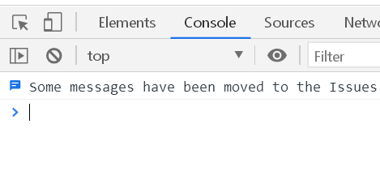
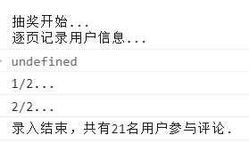
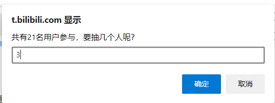
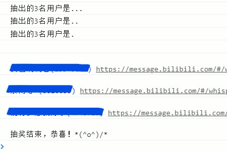

# Bilibili_draw_luckydog

B站动态评论区抽奖，使用页面Console与JS，简单易用。


[参考项目](https://blog.csdn.net/Ikaros_521/article/details/106483311)

[下载本代码](https://github.com/gaylong9/Bilibili_draw_luckydog/releases/download/v1.0/draw.js)

&nbsp;

语言：JavaScript

实现过程：使用Set逐页存储用户ID和昵称，随后生成随机数，输出对应用户信息。

&nbsp;

## 使用

使用：动态详情页，选中“评论”而非“转发”时（默认即是，要求页面上有评论），随便右键选择“检查”（“审查元素”），或直接F12。在出现的选项卡中选中Console（控制台），将代码全部复制进去回车即可。

```javascript
// 设置用全局变量
var luckySum = 0;                   // 中奖总人数
var showId = true;                  // 中奖结果显示ID true/false
var showLink = true;                // 中奖结果显示发送私信连接 true/false
var storeInfoIntervalTime = 1500;   // 存放用户信息的间隔ms
var waitIntervalNum = 3;            // 出结果前等待次数
var waitIntervalTime = 1500;        // 出结果前等待间隔ms

// 功能用全局变量
var idSet = new Set();          // 存放所有参与的用户的id
var nameSet = new Set();        // 存放所有参与的用户的昵称
var luckyInfo = new Array();    // 存放所有抽奖结果信息
var pageSum;                    // 评论总页数
var storeInfoInterval;          // 存储信息用定时器
var waitResInterval;            // 等待结果用定时器
var waitIntervalCnt = 0;        // 出结果前等待计数器
var msgSitePrefix = "https://message.bilibili.com/#/whisper/mid";

// 调用入口方法
draw();

// 入口
function draw() {
    gotoFirstPage();
    var pages = document.getElementsByClassName("tcd-number");
    pageSum = pages[pages.length - 1].childNodes[0].nodeValue;
    console.log("\n抽奖开始...\n逐页记录用户信息...");
    storeInfoInterval = setInterval(getCurPageInfo, storeInfoIntervalTime);
}

// 获取本页信息
function getCurPageInfo() {
    // 当前页数进度
    var currentPage = document.getElementsByClassName("current")[0].childNodes[0].nodeValue;
    console.log(currentPage + "/" + pageSum + "...");

    // 添加本页用户信息
    var cons = document.getElementsByClassName("con ");
    var length = cons.length;
    for (var i = 0; i < length; i++) {
        var userInfo = cons[i].firstChild.getElementsByTagName("a")[0];
        var userId = userInfo.getAttribute("data-usercard-mid");
        var userName = userInfo.childNodes[0].nodeValue;
        idSet.add(userId);
        nameSet.add(userName);
        // console.log("加入用户 " + userName);
    }
    
    // 通过是否有“下一页”按键判断是否到达尾页
    var next = document.getElementsByClassName("next")[0];
    if (next == undefined || next == null) {
        // 到达页尾，开始抽奖
        clearInterval(storeInfoInterval);
        var userNum = idSet.size;
        console.log("录入结束，共有" + userNum + "名用户参与评论.");
        // 获取获奖人数
        if (luckySum <= 0) {
            var getLuckySumMsg = "共有" + userNum + "名用户参与，要抽几个人呢？";
            luckySum = prompt(getLuckySumMsg);
            while (luckySum > userNum) {
                luckySum = prompt(getLuckySumMsg);
            }
        }  
        // 生成幸运数字，从数组中取出放入最终结果
        var luckyNums = generateLuckyNums(userNum, luckySum);
        var idArray = Array.from(idSet);
        var nameArray = Array.from(nameSet);
        var luckyArray = Array.from(luckyNums);
        for (var i = 0; i < luckySum; i++) {
            var id = idArray[luckyArray[i]]
            var name = nameArray[luckyArray[i]];
            var msg ;
            msg = "" + name; 
            if (showId) {
                msg += "(" + id + ")";
            }
            if (showLink) {
                msg += " " + msgSitePrefix + id;
            }
            luckyInfo.push(msg);
        }
        // 出结果前的等待
        waitResInterval = setInterval(waitRes, waitIntervalTime);
        
    } else {
        // 若不是尾页，就click进入下一页
        next.click();
    }
}

// 前往评论首页
function gotoFirstPage() {
    if (document.getElementsByClassName("current")[0].childNodes[0].nodeValue == 1) {
        return;
    }

    document.getElementsByClassName("tcd-number")[0].click();
}

// 在userNum总数中随机生成num个数字并返回
function generateLuckyNums(userNum, luckySum) {
    var temp = 0;
    var luckyNums = new Set();

    for (var i = 0; i < luckySum; i++) {
        // floor([0, 1) * userNum) = [0, userNum - 1]，用作之后下标
        temp = Math.floor((Math.random() * userNum));
        while (luckyNums.has(temp)) {
            temp = Math.floor((Math.random() * userNum));
        }
        luckyNums.add(temp);
    }
    return luckyNums;    
}

// 显示中奖用户
function waitRes() {
    var waitMsg = "抽出的" + luckySum + "名用户是" + ".".repeat(waitIntervalNum - waitIntervalCnt);
    if (waitIntervalCnt == waitIntervalNum) {
        clearInterval(waitResInterval);
        if (waitIntervalNum == 0) {
            console.log(waitMsg);
        }
        console.log("\n");
        for (var i = 0; i < luckyInfo.length; i++) {
            console.log("%c" + luckyInfo[i], "color:blue");
        }
        console.log("\n抽奖结束，恭喜！*(^o^)/*");
        return;
    }
    
    console.log(waitMsg);
    waitIntervalCnt++;
}

```

&nbsp;

## 效果

动态详情页面F12，选中Console/控制台：



把代码复制进去，回车，程序开始执行：



页面弹窗提示输入中奖人数：



短暂等待，输出中奖者信息：



&nbsp;

## 设置

在代码最开始的“设置用全局变量”中，是一些可以自行修改的设置项，不过默认状态即可使用，不修改也无妨。

以下介绍这些设置项：

* `luckySum`：中奖总人数，即要抽出几个中奖者；默认0表示不设置，会在运行过程中弹窗提示输入；若修改则随后不会弹窗询问
* `showId`：中奖结果是否显示ID；默认`true`显示，改为`false`不显示；**但不可改为其他值**
* `showLink`：中奖结果是否显示发送私信链接；默认`true`显示，改为`false`不显示；**但不可改为其他值**
* `storeInfoIntervalTime`：逐页读取用户信息时，每隔一段时间换页，换页、加载本页评论、程序读取计算存储都要消耗时间；本设置就是间隔时间，毫秒为单位，**建议1000以上；默认1500**
* `waitIntervalNum`：展示结果前有一个等待过程，输出几句`抽出的*名用户是...`，本设置项就是设置等待过程中输出次数；默认3
* `waitIntervalTime`：上述等待过程，每次输出间隔多少毫秒；默认1500

&nbsp;

## 可能遇到的问题

本程序未大量做错误输入校验，使用中需要设置项与输入都保持正常合理的数值。

1. 同一页面连续多次运行本程序可能造成出错，建议刷新

2. 运行一开始出现的`undefined`是正常现象 ~~（是Interval的原因吗，不太懂）~~

3. `storeInfoIntervalTime`设置过低时，页面读取顺序混乱，视网速与浏览器处理速度不同，应保证在1000或1500以上（默认1500）

4. 曾遇到下图问题，是由于用户头像出错，无法加载图片，不影响程序使用

	


&nbsp;


